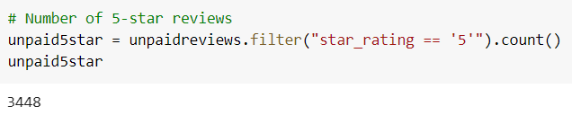

# Amazon Vine Analysis

## Overview
The purpose of this analysis is to find out if the paid Amazon Vine program for doing reviews is biased. I will try to ascertain whether being part of the program makes any difference in the percentage of 5-star ratings. The dataset that I used was luggage.

## Results
First, I narrowed down the dataset, running filters for the following:

- I filtered pieces of luggage that had 20 or more total votes.
  - Of those pieces of luggage, I filtered those whose number of helpful votes divided by the number of total votes were equal to or greater than 50%.

    - Finally, of those pieces of luggage, I filtered on which pieces of luggage were reviewed by Vine members vs non-Vine members.

I will address these questions.

- How many Vine reviews and non-Vine reviews were there?

  - There were 21 Vine reviews:

  

  - There were 6690 non-Vine reviews:

  

- How many Vine and non-Vine reviews were 5 stars?

  - There were 10 5-star Vine reviews:
  

  - There were 3448 5-star non-Vine reviews:
 

- What percentage of Vine and non-Vine reviews were 5 stars?
  
  - For Vine reviews, about 48% were 5 stars:
   

  - For non-Vine reviews, about 52% were 5 stars:
   

## Summary
To summarize:

- As you might expect, the number of Vine reviewers was tiny compared to the number of non-Vine reviewers.

- Vine reviewers gave fewer 5-star ratings for luggage. The non-Vine reviewers were more generous, but only by a few percentage points.

- Paying people to do reviews may make people's expectations higher, thereby making them more critical of the product. The unpaid people may have lower expectations, thereby making them more complimentary.

My assessment is that there is no positivity bias for reviews in the Vine program. 

To study this more with the dataset provided, an additional analysis could be to find out whether the ratings had anything to do with whether the users actually purchased the product, or not.

